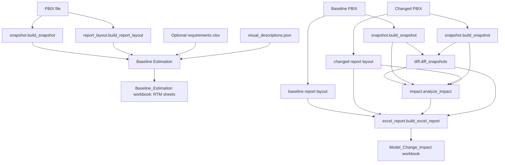
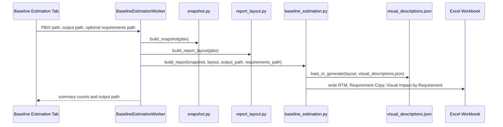
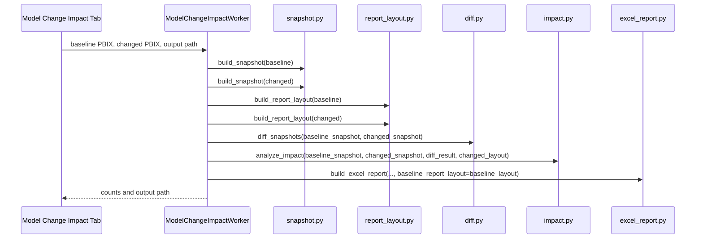

# RTM, Baseline Estimation, and Model Change Impact - Single Source of Truth

Last verified: 2026-09-25

This document explains the current implementation of the **Baseline Estimation** and **Model Change Impact** tabs in the PBIX Lineage Tool. It is intended as a handoff file for future work on a Power BI report, including PBIP work done directly in VS Code.

The descriptions below are based on the current code paths in:

- `gui/main_window.py`
- `gui/worker.py`
- `model_change_impact/snapshot.py`
- `model_change_impact/report_layout.py`
- `model_change_impact/diff.py`
- `model_change_impact/impact.py`
- `model_change_impact/excel_report.py`
- `model_change_impact/baseline_estimation.py`
- `model_change_impact/requirements.py`
- `model_change_impact/requirement_mapping.py`
- `model_change_impact/visual_descriptions.py`

## Executive Summary

The tool has two related but different analysis modes.

**Baseline Estimation** analyzes one existing PBIX file. It produces an RTM-oriented workbook that lists every real report visual, its page, visual type, bound model objects, filters, local visual description, and requirement status. It is used before development to understand which visuals and model objects are in scope.

**Model Change Impact** compares two PBIX files: a baseline PBIX and a changed PBIX. It identifies semantic-model changes, computes downstream model dependencies, maps those changes to report visuals, and writes a model change impact workbook.

The current RTM workflow is especially useful for PBIP work in VS Code because it gives a structured map from requirements to pages, Visual IDs, visual names, visual descriptions, bound tables, measures, columns, and impact basis.

## High-Level Architecture



## Shared Concepts

### Semantic Model Snapshot

`model_change_impact/snapshot.py` reads one PBIX with `pbixray` and extracts a generic model snapshot. The code does not hardcode report-specific table, column, measure, or page names.

The snapshot contains:

- `source_file`
- `extracted_at`
- `tables`
  - table name
  - Power Query M expression when available
  - calculated-table flag
  - hidden flag
  - description
  - lineage tag
  - modified time when available
  - columns
- `measures`
  - table name
  - measure name
  - DAX expression
  - display folder
  - description
  - format string
  - hidden flag
  - lineage tag
  - KPI ID
  - modified time when available
- `calculated_columns`
- `relationships`
  - from table / column
  - to table / column
  - active flag
  - cardinality
  - cross-filtering behavior
  - referential-integrity flag

The snapshot code uses public `pbixray` metadata where possible. For measure metadata not exposed by the public API, it uses a best-effort internal SQL query against `model._metadata.source._db`. That enrichment is wrapped so the snapshot can degrade if `pbixray` changes.

### Report Layout Extraction

`model_change_impact/report_layout.py` parses the report definition stored inside the PBIX zip container.

It supports two report-layout formats:

- `pbir`: modern multi-file Power BI enhanced report format.
- `legacy_layout`: older single-blob `Report/Layout` format.

For each page, the parser extracts:

- page ID
- page display name
- page order
- page filters
- visuals

For each visual, it extracts:

- visual ID
- visual display name when available
- display-name source
- visual kind: `visual` or `visualGroup`
- visual type
- parent group ID
- KPI classification: `certain`, `heuristic`, or blank
- bound fields and measures
- visual filters

Only visuals with `kind == "visual"` are treated as real report visuals. `visualGroup` entries are layout containers and are excluded from visual impact and RTM visual rows.

Legacy-layout visuals sometimes have blank visual IDs. The current parser assigns stable fallback IDs in the form:

```text
legacy:<page-id>:<visual-index>
```

This fallback is required so legacy visuals can be cached, described, and referenced in the RTM workbook.

### KPI Classification

KPI classification is heuristic at the report-visual level.

- Native KPI-like visual types such as `card`, `multirowcard`, `cardvisual`, and `gauge` are classified as `certain`.
- Custom visual types containing `card`, `kpi`, or `gauge` are classified as `heuristic`.
- Other visual types are blank.

This is separate from model-level KPI objects. A report card visual and a semantic-model KPI object are not the same thing.

## Baseline Estimation Tab

### Purpose

The Baseline Estimation tab is a **one-PBIX pre-development impact analysis**. It is used when there is no changed PBIX yet, or when the user wants a planning inventory before modifying the report.

It answers:

- Which report visuals exist?
- Which page is each visual on?
- Which tables, columns, measures, and relationships can affect each visual?
- Which visuals are KPI/card-like?
- Which requirements are mapped to which visuals?
- Which generated requirement numbers are currently production or obsolete?

### GUI Inputs

In the GUI, the Baseline Estimation tab asks for:

- **PBIX file**: one existing PBIX file.
- **Output folder**: defaults to the PBIX folder if blank.
- **Requirements Excel**: optional `.xlsx` file with a `Requirements` sheet.

The output filename is:

```text
Baseline_Estimation_<pbix stem>.xlsx
```

### Worker Flow

The GUI worker path is `BaselineEstimationWorker.run()` in `gui/worker.py`.



### Current Workbook Sheets

The current active Baseline Estimation workbook contains exactly these sheets:

1. `RTM`
2. `Requirement Copy`
3. `Visual Impact by Requirement`

There are helper functions and separate modules in the repository for older or extended sheets such as Object Summary, Model Inventory, Visual Inventory, Requirement Summary, Requirement Traceability, Object Change History, and Unmapped Changes. Those helpers exist in code, but the current active `baseline_estimation.build_report()` path does **not** write them into the workbook.

The current tests also assert this three-sheet workbook structure.

### RTM Sheet

The `RTM` sheet is the main planning sheet.

Current columns:

```text
Requirement Number
Requirement Status
Visual ID
Page Name
Visual Name
Visual Type
KPI Classification
Measures
Columns
Tables
Relationships
Visual Description
Page Filters
Visual Filters
Impact Basis
Object Count
Generated Date
Generated Time
```

Each row is visual-grain, not model-object grain. The tool builds one baseline row for each real Visual ID, then duplicates or updates that row when requirements are mapped to the same visual.

### Requirement Number

When no requirements are supplied, the tool generates a default requirement-like number per visual:

```text
RE1_<visual id sanitized>_<page name sanitized>_<sequence>
```

Example:

```text
RE1_kpi_Overview_001
```

Whitespace and punctuation are removed from the page segment.

When requirements are supplied, numbers are still generated in the `RE1_...` format for the mapped visual rows. Existing historical requirement numbers are reused when possible.

### Requirement Status

The `Requirement Status` column is computed per visual.

- If a visual has no mapped requirement, it is marked `Production`.
- If multiple requirements map to the same visual, the latest one by raised date / row order is marked `Production`.
- Older mapped requirements for the same visual are marked `Obsolete`.
- Historical rows that existed in a previous workbook but are no longer current can also be retained as `Obsolete`.

The tool warns when the same Visual ID is assigned to multiple requirements because the intended rule is one Visual ID per requirement.

### Visual Name

Visual names come from report metadata when available.

When a visual has no readable configured title or display name, the tool creates an explicit label instead of silently exposing the raw internal ID.

Examples:

```text
(Untitled card) _Measures[Total Sales YTD]
(Untitled tableEx) Sales[Amount]
(Untitled visual) [ID: <visual id>]
```

### Visual Description Cache

Visual descriptions are stored in:

```text
visual_descriptions.json
```

The cache is output-folder scoped. For a Baseline Estimation workbook written into a folder, the tool reads or creates:

```text
<output folder>/visual_descriptions.json
```

Current cache behavior:

- Normal workbook generation calls `visual_descriptions.load_or_generate()`.
- If a matching cached description exists for a visual fingerprint, that text is reused.
- If a cached description does not exist, a short deterministic fallback is created.
- The explicit command `tools/populate_visual_cache.py` force-refreshes all descriptions with richer local wording.
- No OpenAI, Azure OpenAI, or external LLM service is used.
- Current enriched entries use:

```json
"generated_by": "local_enriched",
"enrichment_version": 2
```

- Previous descriptions are preserved in each entry's `history` array.

The visual fingerprint is based on visual type, display name, KPI classification, bound fields, and filters. If those facts change, the cache can detect the changed visual and regenerate or preserve history.

### Local Visual Description Format

The local enriched description format uses these headings:

```text
Purpose:
Data:
Grouping:
Filters:
Interaction:
```

The wording is fact-bound. It uses only metadata from the PBIX report layout. It does not infer trends, business outcomes, strategy, or performance meaning.

For unclear visuals with no readable title or no binding, it adds a review note instead of inventing purpose.

### Requirement Workbook Contract

The optional requirements workbook must contain a sheet named:

```text
Requirements
```

Mandatory columns:

```text
Requirement ID
Title
Status
```

Recommended columns:

```text
Description
Priority
Raised Date
```

Optional context columns:

```text
Business Owner
Business Area
Expected Change Date
Notes
```

Supported report-scope columns:

```text
Impacted Pages
Impacted Visuals
Impacted Visual IDs
```

The loader also accepts `Requirement Number` as an alias for `Requirement ID`, and `Requested By` as an additional mapped field.

Valid status values:

```text
Proposed
Approved
In Progress
Done
Cancelled
```

`Done` and `Cancelled` are inactive statuses.

Valid priority values:

```text
Critical
High
Medium
Low
```

Default priority is `Medium`.

Dates must be ISO-style `YYYY-MM-DD`; invalid dates are ignored with warnings.

### Requirement Mapping Rules

Requirement mapping is intentionally report-grain. Users do not need to know model object names.

Supported mapping sources:

1. `Impacted Visual IDs`
2. `Impacted Visuals`
3. `Impacted Pages`
4. Visual title tags like `[R-104]`
5. Generated requirement number match in the form `REQ-<Visual ID>`
6. Dependency expansion from mapped visuals to model objects and directly impacted visuals

There is deliberately **no keyword inference** from requirement title or description. This avoids noisy false positives.

If a requirement does not match any page, visual name, visual ID, or tag, it maps to nothing and receives a warning.

### Mapping Confidence

Mapping sources have confidence levels:

| Source | Confidence |
|---|---|
| Requirement Number | High |
| Visual ID | High |
| Visual Name | High |
| Page | High |
| Tag | High |
| Dependency | Medium |

Dependency expansion uses the same impact engine as Model Change Impact.

Dependency-expanded visuals are surfaced only when directly bound to an impacted object. Slicer-type controls are excluded from dependency-surfaced visuals so the requirement visual count does not get flooded by report-wide filter controls.

Declared visuals from page, visual name, visual ID, or tag are never filtered out.

### Visual Impact by Requirement Sheet

This sheet lists requirement-to-visual rows.

Current columns:

```text
Requirement Number
Requirement Status
Requirement Title
Priority
Status
Visual ID
Page Name
Visual Name
Visual Type
KPI Classification
Measures
Columns
Tables
Relationships
Page Filters
Visual Filters
Visual Description
Impact Basis
Review Flag
Generated Date
Generated Time
```

Rows are created only for mapped requirement visuals. If no requirements are supplied, this sheet can be empty.

Review Flag is `Yes` when:

- the requirement mapping produced warnings, or
- the baseline impact basis includes transitive dependency impact.

### Requirement Copy Sheet

This sheet copies the requirement workbook content into the generated workbook. If no requirements are supplied, it contains the generated requirement numbers with generated date and time.

Current columns:

```text
Requirement Number
Requirement Type
Raised Date
Requested By
Business Owner
Business Area
Title
Status
Description
Priority
Expected Change Date
Impacted Pages
Impacted Visuals
Impacted Visual IDs
Notes
Generated Date
Generated Time
```

### Baseline Estimation Summary Counts

The GUI shows these cards after the run:

- Model Objects
- Impact Rows
- Visuals Impacted
- KPI Visuals
- Pages Affected
- Requirements Mapped

The worker summary includes:

- output path
- selected object count
- model object count
- active requirements count
- mapped model object count
- impact rows
- impacted visuals
- affected pages
- KPI visuals

## Model Change Impact Tab

### Purpose

The Model Change Impact tab is a **two-PBIX comparison workflow**. It is used after changes have been made or when comparing a before/after pair.

It answers:

- Which semantic model objects were added, removed, modified, or renamed?
- Which visuals are directly impacted?
- Which visuals are impacted through DAX dependency chains?
- Which visuals may be broadly affected by table or relationship changes?
- Which report layout changes are actual report changes rather than candidate model impact?

### GUI Inputs

The Model Change Impact tab asks for:

- baseline PBIX file
- changed PBIX file
- output folder

The output filename is:

```text
Model_Change_Impact_<baseline stem>_to_<changed stem>.xlsx
```

### Worker Flow

The GUI worker path is `ModelChangeImpactWorker.run()` in `gui/worker.py`.



The changed PBIX report layout is used for visual impact because it represents the report after the model changes. The baseline layout is also parsed and passed to the Excel report so actual report layout changes can be compared.

### Diff Engine

`model_change_impact/diff.py` compares the baseline snapshot and changed snapshot.

It produces one diff section for each object type:

- tables
- columns
- measures
- relationships

Each section has:

```text
added
removed
changed
unchanged_count
```

Tables, columns, and measures are matched primarily by `lineage_tag`, then by identity keys. A lineage-tag match where the name/table identity changes is flagged as a rename candidate.

Relationship matching uses from-table/from-column/to-table/to-column because relationships do not have stable lineage tags in this snapshot schema.

Relationships are tagged with a detection method. Auto-detected and uncertain relationships are excluded from impact analysis and from the changed-relationship sheet.

### Compared Fields

Tables compare:

- calculated-table flag
- M expression
- hidden flag
- description

Columns compare:

- data type
- calculated flag
- expression
- format string
- hidden flag
- description
- display folder

Measures compare:

- expression
- display folder
- description
- format string
- hidden flag
- KPI ID

Relationships compare:

- active flag
- cardinality
- cross-filtering behavior
- referential-integrity flag

### Impact Analysis

`model_change_impact/impact.py` computes downstream impact.

The impact engine builds a DAX dependency graph from measure and calculated-column expressions. It uses a regex-based scanner, not a full DAX parser.

Impact direction is important:

```text
changed object -> dependent objects -> visuals bound to affected objects
```

It walks **upward to dependents**, not downward to dependencies.

Example:

- If measure `[Total Sales]` changes, a dependent measure `[Total Sales YTD]` can be affected.
- A visual bound to `[Total Sales YTD]` can be impacted through a dependency chain.
- The raw columns referenced inside `[Total Sales]` are not treated as impacted simply because the measure changed.

### Impact Basis

The impact basis explains why a visual appears.

| Basis | Meaning |
|---|---|
| Direct | The visual is directly bound to the changed measure or column. |
| Dependency chain | The visual is bound to an object that depends on the changed object. |
| Direct (references removed object) | The changed report still references an object removed from the model. This is a likely broken binding. |
| Broad (table/relationship-level) | The visual was included because table or relationship changes seed many columns. This is intentionally broad and should be reviewed. |
| No visual binding found | The object changed but no matching visual binding was found. |

Table changes are broad because a Power Query/table-level change may affect many columns. Relationship changes are broad because filter propagation can affect both related tables.

### Actual Report Change

`report_layout.compare_report_layouts()` compares baseline and changed report metadata.

It flags actual report changes when:

- a visual was added or removed, or
- a visual type changed, or
- a visual's field bindings changed.

The Model Change Impact report also marks direct and dependency-chain model impacts as `Actual Report Change = Yes`, while broad table/relationship impact remains `No` unless the layout diff confirms visual metadata changed.

This is metadata comparison, not a screenshot or rendered-visual comparison.

### Current Model Change Impact Workbook Sheets

The current active `excel_report.build_excel_report()` path writes exactly these sheets:

1. `Summary`
2. `Impact Summary`
3. `Changed Tables`
4. `Changed Measures`
5. `Changed Columns`
6. `Changed Relationships`

Older helper functions still exist in `excel_report.py` for `Visual Impact`, `KPI Impact`, `Playwright Input`, `Manual Review`, and `Object Inventory`, but the current report builder does not create those sheets. Current tests explicitly verify that those unrequested detail sheets are not created.

### Summary Sheet

The `Summary` sheet contains:

- report title
- baseline file
- changed file
- changed report layout format
- counts for added, removed, changed, rename candidates, and unchanged tables/measures/columns/relationships
- detail-sheet hyperlinks
- auto-detected relationship count when applicable
- impacted visual summary counts
- broad/heuristic-only visual count
- impacted KPI/card visual count
- Playwright test candidate count, derived from visual impact rows even though the Playwright sheet is not currently written
- manual review item count, derived from internal review-row logic even though the Manual Review sheet is not currently written

### Impact Summary Sheet

Current columns:

```text
Changed Object Type
Changed Object
Change Type
Affected Visual ID
Affected Visual Name
Visual Type
Page Name
Is KPI
KPI Confidence
Impact Basis
Actual Report Change
```

This sheet is one row per changed object and affected visual. If a changed object has no visual binding, it still gets a row with `Impact Basis = No visual binding found`.

### Changed Tables, Measures, Columns, Relationships

The changed-object detail sheets list before/after values.

For changed fields, the workbook uses rich text where possible:

- removed text is red and struck through in the before cell
- added text is green and bold in the after cell

DAX and M expressions are not normally truncated. They are capped only at Excel's cell limit.

The `Changed Relationships` sheet only lists manual relationships. Auto-detected or uncertain relationships are excluded.

## How This Supports PBIP Work in VS Code

The RTM workbook is the practical bridge between requirement planning and PBIP source editing.

### Recommended PBIP Workflow

1. Generate or refresh the Baseline Estimation workbook.
2. Use the `RTM` sheet to identify:
   - Requirement Number
   - Requirement Status
   - Visual ID
   - Page Name
   - Visual Name
   - Visual Type
   - KPI Classification
   - Measures
   - Columns
   - Tables
   - Visual Description
   - Page Filters
   - Visual Filters
   - Impact Basis
3. Open the PBIP project in VS Code.
4. Use page names and Visual IDs from RTM to find the relevant report definition files.
5. Use the bound measures/columns/tables from RTM to identify semantic model objects that need to be changed.
6. Make PBIP edits.
7. Re-run Baseline Estimation or Model Change Impact to validate the resulting scope.

### Which RTM Fields Matter Most for PBIP Edits

| RTM field | PBIP use |
|---|---|
| Requirement Number | Planning and traceability key. |
| Requirement Status | Distinguishes Production vs Obsolete requirement rows for the same visual. |
| Visual ID | Most precise way to locate a visual. |
| Page Name | Helps locate the page folder/definition. |
| Visual Name | Human label; may not be unique. |
| Visual Type | Helps understand whether it is a card, table, chart, slicer, etc. |
| KPI Classification | Highlights high-value card/KPI-like visuals. |
| Measures | Measures directly or dependently associated with the visual. |
| Columns | Columns directly or dependently associated with the visual. |
| Tables | Tables with broad model impact. |
| Relationships | Relationships with broad filter-propagation impact. |
| Visual Description | Local narrative of what the visual does, derived from PBIX metadata. |
| Page Filters | Page-level filter fields detected in metadata. |
| Visual Filters | Visual-level filter fields detected in metadata. |
| Impact Basis | Direct, dependency-chain, or broad impact reason. |

### Precision Rules

When mapping work or requirements:

1. Prefer Visual ID.
2. Use Visual Name only when the same visible name may intentionally map to multiple visuals.
3. Use Page scope when a whole page is in scope.
4. Avoid relying on requirement title/description keywords. The tool intentionally does not infer scope from text.

## Known Limitations and Review Points

### Report Layout Parsing

PBIR parsing is the best-supported path. Legacy `Report/Layout` parsing is supported but best-effort and carries an unsupported/manual-review reason.

### DAX Dependency Analysis

Dependency scanning is regex-based. It is designed for impact triage, not as a complete DAX compiler.

### Relationship Impact

Relationship changes use broad impact. They should be reviewed manually because filter propagation can affect many visuals indirectly.

### Table Impact

Table-level changes seed all columns of that table. This is intentionally conservative.

### Visual Descriptions

Descriptions are local, deterministic, and fact-bound. They are not generated by Azure/OpenAI. They are meant to be user-friendly metadata summaries, not human-certified business definitions.

### Current Workbook Sheet Reality

Some modules contain helper functions or comments for sheets that are not currently written by the active code paths. Treat the active workbook sheet lists in this document as authoritative unless the code is changed.

## Current Validation Snapshot

The most recent focused validation for the visual description and report layout slice passed:

```text
16 passed
```

The current refreshed visual-description cache contains 336 version-2 local-enriched descriptions, and the generated `Baseline_Estimation_DTS_CashPlus_Dashboard_1.xlsx` RTM sheet was verified to match the cache exactly for 336 visual rows.

## Files to Share With a Future Chat

For a future assistant or developer working on PBIP in VS Code, share this file first:

```text
docs/RTM_BASELINE_MODEL_CHANGE_IMPACT_CONTEXT.md
```

Then share these project artifacts if needed:

```text
Baseline_Estimation_<pbix stem>.xlsx
visual_descriptions.json
model_change_impact/baseline_estimation.py
model_change_impact/report_layout.py
model_change_impact/snapshot.py
model_change_impact/impact.py
model_change_impact/diff.py
model_change_impact/excel_report.py
```

Use the RTM sheet as the working index for PBIP edits, and use Model Change Impact when comparing a before/after PBIX pair.